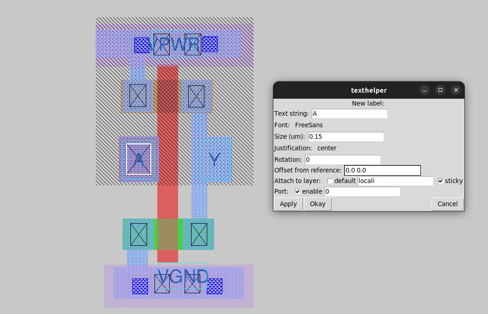
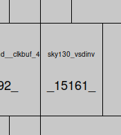

# Physical_design_open_lane


<details>
<summary>DAY-1</summary>

### Introduction to package, chip, pads, core, die and IPs
This section explains about various terminology used in ASIC chip design. 

Let us consider Arduino board which is basic embedded toolkit used for embedded programming. This arduino board has a processor chip which contains multiple interfaces for various applications. 
Package refers to housing where integrated circuit is placed.
Chip is placed usually at centre of package where leads of package are connected  through thin wires.
Pads are placed to send or received signals from or to leads of package and core.
Core refers to actual circuit designed with particular components and technology process which handles the logic.
Die is base of chip on which entire integrated circuit is built and cut out off wafer.
IPs are kind of blackbox where functionality of circuit is known and not design. We usually use IPs where we reuse of existing code in the form of IPs.

### Introduction to open source ASIC design flow
At every level, from the transistor level to the architectural level, computer programmes are used to build both analog and digital electronics. These tools support chip designers from RTL to GDS.
We have tools like Openlane, Openroad as EDA tool. Process design kit is collection of files that is used to model a fabrication process for EDA tools for designing a IC. It contains design rules like DRC & LVS, device models, standard cell libraries and I/O libraries. Google joined hands with skywater to produce open source PDK in 130nm technology node.

We have following ASIC flow:


1. Synthesis: Converts RTL code to gate level netlist from standard cell libraries.

2. Floor & power planning: Decides partition between different system blocks and places I/O pads. We place power rails to provide power to various components of system.

3. PLacement: We place standard cells from netlist on decided floor plan.

4. Clock tree synthesis: We create a clock distribution network to deliver clock signals sequential part of system.

5. Routing: Interconnection of blocks using metal layers.

6. Final verification: We perform DRC-design rule check, Layout vs schematic check, Static timing analysis.

### Introduction to Open-lane

OpenLane is an automated RTL to GDSII flow based on several components including OpenROAD, Yosys, Magic, Netgen, CVC, SPEF-Extractor, KLayout and a number of custom scripts for design exploration and optimization. The flow performs all ASIC implementation steps from RTL all the way down to GDSII. 


### Various Open source tools in ASIC flow

RTL simulation: Iverilog & gtkwave

RTL synthesis & mapping: yosys

Floor planning : ioplacer

PLacement: OpenPD

STA: OpenSTA

clock tree synthesis: Triton CTS

Routing: TritonRoute

SPEF extraction: SPEF-extractor

DRC, GDS-II: Magic

LVS: Netgen

Circuit simulation: ngspice

### Openlane tool

We follow below steps to invoke the tool.
Go to openlane folder created in home folder.
```
make mount 
```

```
OpenLane Container (2264b12):/openlane$ ./flow.tcl -interactive
% package require openlane 0.9
```


Then prepare the design for RTl-GDS flow and run a synthesis command for picorv32a design as a sample. The picorv32a is present in design folder of openlane along with few other sample designs.
```
prep -design picorv32a
run_synthesis
```

Then we review result of synthesis flow. A folder by the name runs is created in picorv32a folder which contains folders related to ASIC flow like placement, synthesis, routing etc. We access report folder os synthesis and analyze the result as follows.


</details>

<details>
<summary>DAY-2</summary>

### Utilization factor and aspect ratio

Core is where actual circuit netlist is placed and die just encapsulates the core. We are interested to understand area, utilization factor and aspect ratio of core.

If we have any logical circuit, we assume it be a square based area, we try to determine the area of core where we can fit in out circuit. 

Area is simpliy the sum of product of width and height of standard cells and flip flops. 


Utilization factor is ratio of area occupied by netlist to total area of core. From this we find that, area of netlist and core is not always same. If this ratio is 1, then it is 100% utilization of core and no wastage of area.

```
Utilization factor = Area occupied by circuit / Area of core
```

Aspect ratio is ratio of height to width of core. If this ratio is 1, then is is means that core is square in shape.
```
Aspect ratio = Height of core / Width of core
```

### Concept of pre-placed cells

Let's consider that we have a circuit which performs a certain function in top level module. But, we will separate them into multiple blocks where interconnect each of them again through wires. The importance of this concept lies in the fact that we may have a functionality being implemented in multiple plcaes, we need not separately implement. We implement this block once and have multiple copies used for better & faster implementation. Some of these blocks found in market are memory, multiplexers, comparators and many more. These are called as pre-placed blocks.


### Decoupling capacitor

Decoupling capacitors are used to maintain stable supply to internal digita circuits. Without these, due to presence of wire resistance & inductance, the voltage represented by logic 1  or 0 might not be achieved due to noise margin of circuit. We want the voltage levels to lie within noise margin to able to distinguish between logic 1 & 0.

### Power planning

Power planning in chip design is an important aspect. Let us consider that we have circuit with on power supply. We have used decipuling capacitors for input ports to avoid destrcution of voltage levels. But is not possible to add these capacitors everywhere as it increases the size & feasible solution. Instead we increase the power supply given to chip so that particular logical part of circuit receives power from nearest power rail. Without this power planning, ground bounce where many points are discharging to single ground and voltage level of ground increases beyond noise marging causes ambiguity in logic level. Same concept applies to voltage drop where power voltage drops if many points in circuit draw power at same time.

### Pin placement
Pin placement refers to deciding input and output ports location on core. It decides delay and amount of wire requried to connect blocks. So it decides size of pins to provide power signal strength. We place these pins between space die and core border. This space does not contain any other cells of circuit.


### Floorplan of picorv32a

We perform floorplanning we use following command.
```
run_floorplan
```


Then we go to results folder of floorplan and open floorplan file .def in magic tool as shown below.
```
magic -T <techfile> lef read <lef_file> def read <def-file>
```


### Netlist binding and initial place design

After we design the system with netlist consisting of various cells, we consider these cells. These cells are taken from library where size & delay and other details associated with each cell. We take the floorplan performed in previous step for placement & routing. We place standard cells in a way similar to netlist like placing a cell closer to input port and placing another cell closer to output to have lesser delay. This is known as initial placement.


### Optimized placement using estimated wire-length and capacitance

In this stage, we estimate length & capacitance of wires to determine the optimized placement of cells. So if we have not maintained signal integrity, then we use buffers to reduce wire length and capacitance and have optimized placement.

### Placement step in openlane

Placement occurs in two stages: GLobal & detailed placement.
Global Placement: It finds optimal position for all cells which may not be legal and cells may overlap. Optimization is done through reduction of half parameter wire length.

Detailed Placement: It alters the position of cells post global placement so as to legalise them.

We peform placement in openlane as follows:
```
run_placement
```


### Cell design

Standard cell design flow involves the following:

-Inputs: PDKs, DRC & LVS rules, SPICE models, libraries, user-defined specifications.

-Design steps: Circuit design, Layout design (Art of layout Euler's path and stick diagram), Extraction of parasitics, Characterization (timing, noise, power).

-Outputs: CDL (circuit description language), LEF, GDSII, extracted SPICE netlist (.cir), timing, noise and power .lib file

### Standard cell characterisation

Standard cell characterization follows below step:

Logic (Boolean function)

Schematic (Connection pins only)

Netlist (Internal circuit made of transistors)

Netlist with parasitics

Physical Layout

Timing (Delays, hold and setup times, ...)

Power

Noise

We use software called GUNA to perform above characterization steps.

### Timing characterization parameters

We have timing threshold definitions as follows:

slew_low_rise_thr	20% value

slew_high_rise_thr	80% value

slew_low_fall_thr	20% value

slew_high_fall_thr	80% value

in_rise_thr	        50% value

in_fall_thr	        50% value

out_rise_thr	        50% value

out_fall_thr	        50% value


Propogation delay: Time difference between input waveform & output waveform crossing 50% of reference value.
Poor choice of threshold value can lead to negative delays.


</details>

<details>
<summary>DAY-3</summary>


### IO placer revision


Previously, we used equidistant value for IO pins in layout. Now we want to change to some other format, we edit environment variable and run floorplan flow again as follows:

```
set ::env(FP_IO_MODE) 2
```


### Spice deck

A SPICE deck includes information about the following:

Model description

Netlist description

Component connectivity

Component values

Capacitance load

Nodes

Simulation type and parameters

Libraries included

Following is Spice netlist for inverter.


```
.title CMOS inverter
.include 
M1 out in vdd vdd pmos w=0.375u l=0.25u
M2 out in 0 0 nmos w=0.375u l=0.25u
cload out 0 10f
Vdd vdd 0 2.5
Vin in 0 2.5

**control cmds
.op
.dc Vin 0 2.5 0.05
.plot v(out) vs v(in)
.end
```

We change width of pmos to 0.9375 then we get following characteristics with shifted threshold.


We compare as follows:

| Inverter wp=0.375 | Inverter wp=0.9375 |
| --- | --- |
|  |  |


### Switching characteristics

In this section, we try to understand switching characteristics ie rise delay & fall delay of inverter.

We use previous netlist and provide a pulse as input to determine rise & fall delay.

| PMOS W/L ratio | NMOS W/L ratio | Rise delay | Fall delay |
| --- | --- | --- | --- |
| Wp/Lp | Wn/Ln | 100.97ps | 49.61ps |
| Wp/Lp | 2Wn/Ln | 109.88ps | 32.03ps |
| Wp/Lp | 3Wn/Ln | 119.15ps | 23.721ps |

### Inverter layout

We git clone vsdstdcelldesign github repository for inverter layout.
```
git clone https://github.com/nickson-jose/vsdstdcelldesign.git
```


### 16 Fabrication of Mask CMOS
The following steps comprise the 16-mask CMOS process:

choosing a substrate: separating the substrate/body material.

Making a transistor's active region: SiO2 and Si3N4 etching and deposition, followed by photolithography, are used to isolate between active area pockets.

Ion implanation for the creation of the N- and P-wells: boron for the P-well and phosphorus for the N-well.

Photolithography processes are used to produce the NMOS and PMOS gates at the gate terminal.

LDD formation: LDD developed to counteract the hot electron effect.

In order to prevent channelling during implants, screen oxide is applied before aresenic is implanted, followed by annealing.

Local connection formation: HF etching is used to remove screen oxide. Ti is deposited for low-resistance connections.

Planarization of higher level metals using CMP, followed by TiN and Tungsten deposition. Top SiN layer for chip protection.

### Spice extraction & simulation

In this section, we will verify the logic implemented by layout by extracting spice netlist and performing simulation in ngspice.

In Tckon window of magic, we use following commands
```
extract all
ext2spice cthresh 0 rthresh 0
ext2spice
```
We have two files sky130_inv.ext & sky130_inv.spice created.


We perform ngspice simulation for extracted netlist.

Netlist:
```
* SPICE3 file created from sky130_inv.ext - technology: sky130A

.option scale=0.01u
.include ./libs/pshort.lib
.include ./libs/nshort.lib

//.subckt sky130_inv A Y VPWR VGND
M1000 Y A VPWR VPWR pshort_model.0 w=37 l=23
+  ad=1443 pd=152 as=1517 ps=156
M1001 Y A VGND VGND nshort_model.0 w=35 l=23
+  ad=1435 pd=152 as=1365 ps=148

VDD VPWR 0 3.3v
VSS VGND 0 0v
Va A VGND PULSE (0 3.3 0 0.1n 0.1n 2n 4n)

C0 VPWR A 0.07fF
C1 VPWR Y 0.11fF
C2 Y A 0.05fF
C3 Y VGND 2fF
C4 VPWR VGND 0.59fF
.end
```

```
ngspice sky130_inv.spice
tran 1n 20n
plot v(y) v(a)
```


We calculate Rise time, fall time, rise delay, fall delay & propogation delay.

Rise time: 63.44ps
Fall time: 42.68ps
Rise delay: 60.46ps
Fall delay: 25.58ps

### DRC violations

We try to understand DRC violations through examples.
Download sample magic layout files from following website.

```
wget http://opencircuitdesign.com/open_pdks/archive/drc_tests.tgz
tar xfz drc_tests.tgz
```

Now, open sample file as shown
```
magic -d XR met3.mag
```

Below is rules for me3 layer.


We use 'drc_why' command errors in layout as shown.


We use following commands to see metal cut as shown.

```
cif see VIA2
```

### Fixing poly.9 error in sky130A.tech file - lab

Open the poly.mag file in magic tool.

```
magic -d XR poly.mag
```


We find that distance between regular polysilicon & poly resistor should be 22um but it is showing 17um and still no errors . We should go to sky130A.tech file and modify as follows to detect this error.

In line 
```
spacing npres *nsd 480 touching_illegal \
	"poly.resistor spacing to N-tap < %d (poly.9)"
```

change to 

```
spacing npres allpolynonres 480 touching_illegal \
	"poly.resistor spacing to N-tap < %d (poly.9)"
```


Also,

```
spacing xhrpoly,uhrpoly,xpc alldiff 480 touching_illegal \

	"xhrpoly/uhrpoly resistor spacing to diffusion < %d (poly.9)"
```
change to

```
spacing xhrpoly,uhrpoly,xpc allpolynonres 480 touching_illegal \

	"xhrpoly/uhrpoly resistor spacing to diffusion < %d (poly.9)"
```

Again we load poly.mag file we find that it is detecting this erroe with DRC errors increased to 35 from 32.


</details>


<details>
<summary>DAY-4</summary>

### Converting grid info to track info

The requirement of ports is mentioned in track.info as shown below.

```
li1 X 0.23 0.46
li1 Y 0.17 0.34
met1 X 0.17 0.34
met1 Y 0.17 0.34
met2 X 0.23 0.46
met2 Y 0.23 0.46
met3 X 0.34 0.68
met3 Y 0.34 0.68
met4 X 0.46 0.92
met4 Y 0.46 0.92
met5 X 1.70 3.40
met5 Y 1.70 3.40
```
Before convergence, we grid as follows as:


To ensure that ports lie on the intersection point, the grid spacing in Magic (tkcon) must be changed to the li1 X and li1 Y values. After providing the command, we have following:
```
grid 0.46um 0.34um 0.23um 0.17um
```


### Conversion of magic layout to standard cell LEF file

Extraction of the LEF file for the cell comes next when the layout is completed. To help the placer and router tool, specific characteristics and definitions must be defined for the cell's pins. Ports are the macro's declared PINs, and in LEF files, a cell containing ports is written as a macro cell. Our goal is to extract LEF in a predetermined format from a configuration (in this case, a straightforward CMOS inverter). The first step is to define each port and assign the appropriate class and use characteristics to each port.

Below are steps to define a port :

First, open the.mag file for the design in the Magic Layout window. Next, select Edit >> Text to bring up a dialogue window. Use locali for port y & a, use metal 1 for vdd & gnd as shown in figures below.




Define the purpose of ports as follows in tkcon window:

```
port A class input
port A use signal

port Y class output
port Y use signal

port VPWR class inout
port VPWR use power

port VGND class inout
port VPWR use ground
```

We generate lef file by command:
```
lef write <name>
```
This generates sky130_vsdinv.lef file.

### Steps to include custom cell in ASIC design

We have created a custom standard cell in previous steps of an inverter. Copy lef file, sky130_fd_sc_hd_typical.lib, sky130_fd_sc_hd_slow.lib & sky130_fd_sc_hd_fast.lib to src folder of picorv32a from libs folder vsdstdcelldesign. Then modify the condif.tcl as follows.

```

# Design
set ::env(DESIGN_NAME) "picorv32a"

set ::env(VERILOG_FILES) "$::env(DESIGN_DIR)/src/picorv32a.v"

set ::env(CLOCK_PORT) "clk"
set ::env(CLOCK_NET) $::env(CLOCK_PORT)

set ::env(GLB_RESIZER_TIMING_OPTIMIZATIONS) {1}

set ::env(LIB_SYNTH) "$::env(OPENLANE_ROOT)/designs/picorv32a/src/sky130_fd_sc_hd__typical.lib"
set ::env(LIB_SLOWEST) "$::env(OPENLANE_ROOT)/designs/picorv32a/src/sky130_fd_sc_hd__slow.lib"
set ::env(LIB_FASTEST) "$::env(OPENLANE_ROOT)/designs/picorv32a/src/sky130_fd_sc_hd__fast.lib"
set ::env(LIB_TYPICAL) "$::env(OPENLANE_ROOT)/designs/picorv32a/src/sky130_fd_sc_hd__typical.lib"

set ::env(EXTRA_LEFS) [glob $::env(OPENLANE_ROOT)/designs/$::env(DESIGN_NAME)/src/*.lef]

set filename $::env(DESIGN_DIR)/$::env(PDK)_$::env(STD_CELL_LIBRARY)_config.tcl
if { [file exists $filename] == 1} {
	source $filename
}
```

To integrate standard cell in openlane flow, perform following commands:

```
set lefs [glob $::env(DESIGN_DIR)/src/*.lef]
add_lefs -src $lefs
```

### Delay tables

We observe that the buffer we insert to maintain signal integrity has some constraints. We observe that size of buffer in every level should have same size and have different delays depending on load driven by them. So VLSI engineers came up with concept of delay tables which consists of 2D array of values input slew & load capacitance defined for cell for different sizes. These delay tables became timing models. The algorithm takes these values and computes delay values. If delay is not available directly, it takes nearest data and determines through extrapolation.


### Openlane steps with custom standard cell

We perform synthesis and found that it has positive slack and met timing constraints.

We perform floorplan and find out custom cell included as follows.


We perform placement step as well.


</details>


<details>
<summary>References</summary>

https://github.com/kunalg123/

https://openlane.readthedocs.io/en/latest/getting_started/installation/installation_ubuntu.html#installation-of-required-packages

https://github.com/The-OpenROAD-Project/OpenLane

https://vsdiat.com/

https://github.com/Devipriya1921/Physical_Design_Using_OpenLANE_Sky130

https://github.com/nickson-jose/vsdstdcelldesign

</details>
